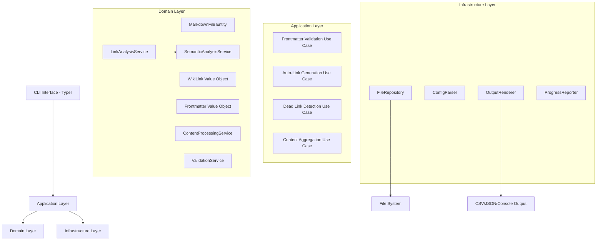
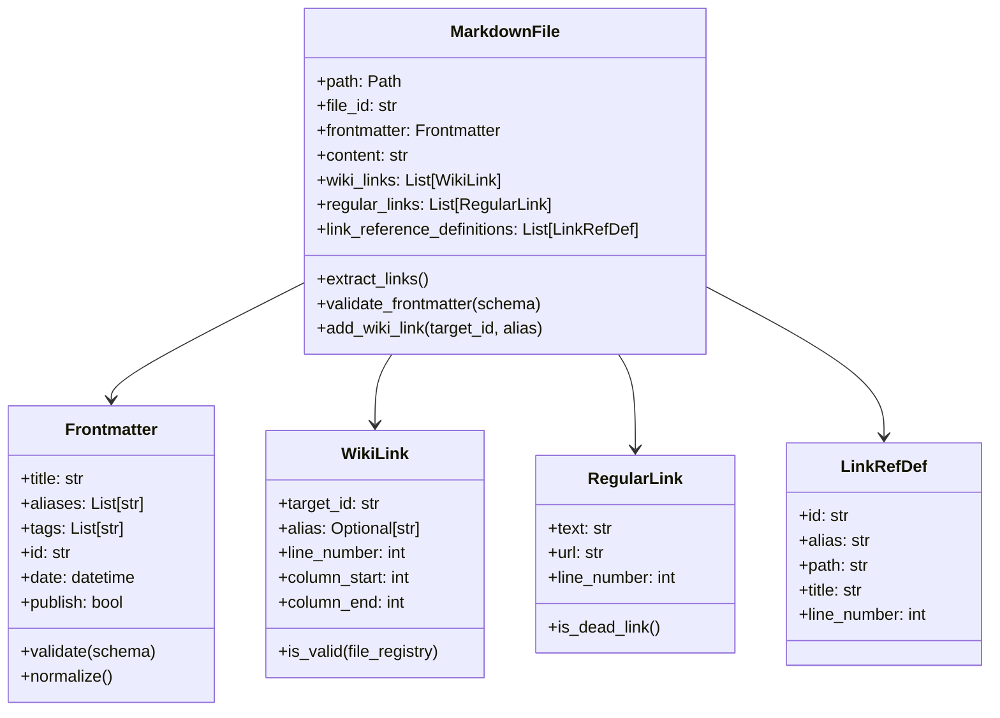

# Design Document

## Overview

The Knowledge Base Organizer is designed as a modular CLI application using Domain-Driven Design principles. The system processes Obsidian vaults by analyzing markdown files with YAML frontmatter, detecting WikiLinks and regular links, and providing quality improvement operations.

The architecture follows a clean architecture pattern with clear separation between domain logic, application services, and infrastructure concerns. The system is built for extensibility, allowing easy addition of new analysis and processing capabilities.

## Architecture

### High-Level Architecture



### Domain Model



## Components and Interfaces

### 1. CLI Interface Layer

**Technology:** Typer with Rich for enhanced output formatting

```python
# Main CLI commands structure
@app.command()
def validate_frontmatter(
    vault_path: Path,
    template: Optional[Path] = typer.Option(None, "--template", help="Template file to use as schema reference"),
    dry_run: bool = typer.Option(True, "--dry-run/--execute", help="Preview changes without applying them"),
    output_format: OutputFormat = typer.Option(OutputFormat.JSON, help="Output format"),
    include_patterns: Optional[List[str]] = typer.Option(None, "--include", help="Include file patterns"),
    exclude_patterns: Optional[List[str]] = typer.Option(None, "--exclude", help="Exclude file patterns"),
    verbose: bool = typer.Option(False, "--verbose", "-v", help="Show detailed output including type conversions")
) -> None:
    """Validate and fix frontmatter according to template schema

    When --template is specified, uses that template file's frontmatter as the schema.
    When --template is not specified, uses automatic template detection from template directories.

    Examples:
        # Validate using specific template
        validate-frontmatter /path/to/vault --template ~/vault/900_TemplaterNotes/new-fleeing-note.md

        # Apply fixes using template
        validate-frontmatter /path/to/vault --template ~/vault/900_TemplaterNotes/new-fleeing-note.md --execute

        # Legacy mode (auto-detect templates)
        validate-frontmatter /path/to/vault
    """

@app.command()
def auto_link(
    vault_path: Path,
    dry_run: bool = True,
    exclude_tables: bool = False,
    max_links_per_file: int = 50,
    output_format: OutputFormat = OutputFormat.JSON
) -> None:
    """Generate WikiLinks from plain text mentions"""

@app.command()
def detect_dead_links(
    vault_path: Path,
    output_format: OutputFormat = OutputFormat.JSON,
    check_external_links: bool = False
) -> None:
    """Detect and report dead WikiLinks and regular links"""

@app.command()
def aggregate(
    vault_path: Path,
    output_path: Path,
    tags: List[str] = None,
    search_pattern: str = None,
    deduplicate: bool = True
) -> None:
    """Aggregate notes based on criteria into single file"""
```

### 2. Application Layer - Use Cases

**Frontmatter Validation Use Case:**

```python
class FrontmatterValidationUseCase:
    def __init__(
        self,
        file_repository: FileRepository,
        validation_service: ValidationService,
        output_renderer: OutputRenderer
    ):
        self.file_repository = file_repository
        self.validation_service = validation_service
        self.output_renderer = output_renderer

    def execute(self, request: FrontmatterValidationRequest) -> FrontmatterValidationResult:
        # Load schema and files
        # Validate each file's frontmatter
        # Generate fixes for interactive/automatic mode
        # Apply changes if not dry-run
        # Return structured results
```

**Auto-Link Generation Use Case:**

```python
class AutoLinkGenerationUseCase:
    def __init__(
        self,
        file_repository: FileRepository,
        link_analysis_service: LinkAnalysisService,
        content_processing_service: ContentProcessingService,
        semantic_analysis_service: SemanticAnalysisService
    ):
        # Dependencies injection

    def execute(self, request: AutoLinkRequest) -> AutoLinkResult:
        # Build file registry (id -> file mapping)
        # For each file, find potential link candidates using LinkAnalysisService
        # Use SemanticAnalysisService to score candidates based on context
        # Handle disambiguation for ambiguous links
        # Exclude existing links, frontmatter, tables (if configured)
        # Generate WikiLinks with appropriate aliases based on confidence scores
        # Apply changes if not dry-run
        # Return link generation report
```

### 3. Domain Layer - Core Business Logic

**Link Analysis Service:**

```python
class LinkAnalysisService:
    def find_advanced_link_candidates(
        self,
        content: str,
        file_registry: Dict[str, MarkdownFile],
        exclusion_zones: List[TextRange]
    ) -> List[AdvancedLinkCandidate]:
        """Find text that could be converted to WikiLinks, enriched with semantic context and confidence scores."""

    def detect_dead_links(
        self,
        files: List[MarkdownFile],
        file_registry: Dict[str, MarkdownFile]
    ) -> List[DeadLink]:
        """Detect WikiLinks and regular links that are broken"""

    def calculate_link_density(self, file: MarkdownFile) -> LinkDensityMetrics:
        """Calculate various link metrics for a file"""
```

**Semantic Analysis Service:**

```python
class SemanticAnalysisService:
    def calculate_similarity(self, text1: str, text2: str) -> float:
        """Calculate semantic similarity between two texts using vector embeddings."""

    def get_embedding(self, text: str) -> List[float]:
        """Generate a vector embedding for a given text."""
```

**Content Processing Service:**

```python
class ContentProcessingService:
    def extract_exclusion_zones(self, content: str) -> List[TextRange]:
        """Extract areas where auto-linking should be avoided"""
        # WikiLinks: [[...]]
        # Regular links: [...](...)
        # Frontmatter: --- ... ---
        # Link Reference Definitions: [id|alias]: path "title"
        # Tables (if configured): | ... |

    def apply_wiki_links(
        self,
        content: str,
        link_candidates: List[LinkCandidate]
    ) -> str:
        """Apply WikiLink formatting to identified candidates"""

    def normalize_frontmatter(self, frontmatter: Frontmatter) -> Frontmatter:
        """Standardize frontmatter formatting and remove duplicates"""
```

### 4. Infrastructure Layer

**File Repository:**

```python
class FileRepository:
    def __init__(self, config: ProcessingConfig):
        self.config = config

    def load_vault(self, vault_path: Path) -> List[MarkdownFile]:
        """Load all markdown files matching include/exclude patterns"""

    def save_file(self, file: MarkdownFile, backup: bool = True) -> None:
        """Save file with optional backup creation"""

    def create_backup(self, file_path: Path) -> Path:
        """Create timestamped backup of file"""
```

**Configuration Management:**

```python
@dataclass
class ProcessingConfig:
    include_patterns: List[str] = field(default_factory=lambda: ["**/*.md"])
    exclude_patterns: List[str] = field(default_factory=list)
    frontmatter_schema: Dict[str, Any] = field(default_factory=dict)
    exclude_tables_from_linking: bool = False
    max_links_per_file: int = 50
    backup_enabled: bool = True

    @classmethod
    def from_file(cls, config_path: Path) -> 'ProcessingConfig':
        """Load configuration from YAML file"""
```

## Data Models for Semantic Linking

```python
@dataclass
class PotentialTarget:
    file_id: str
    title: str
    context_similarity: float

@dataclass
class AdvancedLinkCandidate:
    text: str
    position: TextPosition
    potential_targets: List[PotentialTarget]
    best_target: Optional[PotentialTarget]
    confidence_score: float
    requires_disambiguation: bool
```

## Data Models

### Core Entities

**MarkdownFile Entity:**

- Represents a single markdown file with all its metadata and content
- Handles parsing of frontmatter, content, and link extraction
- Provides methods for validation and modification

**Value Objects:**

- `Frontmatter`: Immutable representation of YAML frontmatter
- `WikiLink`: Represents [[id|alias]] or [[id]] links
- `RegularLink`: Represents [text](url) markdown links
- `LinkRefDef`: Represents Foam Link Reference Definitions

### Processing Results

```python
@dataclass
class ValidationResult:
    file_path: Path
    is_valid: bool
    missing_fields: List[str]
    invalid_fields: Dict[str, str]
    suggested_fixes: Dict[str, Any]

@dataclass
class LinkGenerationResult:
    file_path: Path
    links_added: List[WikiLink]
    candidates_found: int
    candidates_applied: int

@dataclass
class DeadLinkResult:
    file_path: Path
    dead_wiki_links: List[WikiLink]
    dead_regular_links: List[RegularLink]
    suggested_fixes: List[str]
```

## Error Handling

### Exception Hierarchy

```python
class KnowledgeBaseOrganizerError(Exception):
    """Base exception for all organizer operations"""

class FileProcessingError(KnowledgeBaseOrganizerError):
    """Raised when file processing fails"""
    def __init__(self, file_path: Path, original_error: Exception):
        self.file_path = file_path
        self.original_error = original_error

class FrontmatterValidationError(KnowledgeBaseOrganizerError):
    """Raised when frontmatter validation fails"""

class ConfigurationError(KnowledgeBaseOrganizerError):
    """Raised when configuration is invalid"""

class LinkProcessingError(KnowledgeBaseOrganizerError):
    """Raised when link processing fails"""
```

### Error Recovery Strategy

1. **File-level errors**: Log error and continue processing other files
2. **Validation errors**: Collect all issues and report at the end
3. **Configuration errors**: Fail fast with clear error messages
4. **I/O errors**: Retry with exponential backoff for transient issues

## Testing Strategy

### Unit Testing

**Domain Layer Testing:**

- Test all business logic in isolation
- Use property-based testing for link detection algorithms
- Mock external dependencies (file system, configuration)

**Application Layer Testing:**

- Test use case orchestration
- Verify proper error handling and result formatting
- Test dry-run vs. actual execution modes

### Integration Testing

**File Processing Integration:**

- Test with real markdown files from test vault
- Verify end-to-end processing workflows
- Test backup and recovery mechanisms

**CLI Integration:**

- Test all CLI commands with various parameter combinations
- Verify output formatting (JSON, CSV, console)
- Test progress reporting and error messages

### Test Data Strategy

**Test Vault Structure:**

```
tests/test-data/vaults/
├── test-myvault/           # Real sample data
├── minimal-vault/          # Minimal test cases
├── edge-cases-vault/       # Edge cases and error conditions
└── performance-vault/      # Large dataset for performance testing
```

**Test Categories:**

1. **Valid cases**: Proper frontmatter, valid links, standard content
2. **Invalid cases**: Malformed frontmatter, broken links, edge cases
3. **Edge cases**: Empty files, special characters, large files
4. **Performance cases**: Large vaults, many links, complex content

### Continuous Integration

**Test Execution:**

- Run full test suite on every commit
- Performance benchmarks on release candidates
- Integration tests with multiple Python versions

**Quality Gates:**

- Minimum 90% code coverage
- All linting rules pass (ruff, mypy)
- No security vulnerabilities (bandit)
- Performance regression detection

## Template-Based Schema Management

### Overview

The system uses template files as the Single Source of Truth (SSoT) for frontmatter schemas. Instead of maintaining separate schema definitions, the system extracts schema rules directly from template files in designated directories (e.g., `900_TemplaterNotes`, `903_BookSearchTemplates`).

### Template Schema Extraction

**Template Schema Repository:**

```python
class TemplateSchemaRepository:
    def __init__(self, vault_path: Path, config: ProcessingConfig):
        self.vault_path = vault_path
        self.config = config

    def extract_schemas_from_templates(self) -> Dict[str, FrontmatterSchema]:
        """Extract frontmatter schemas from template files"""
        schemas = {}

        for template_dir in self.config.template_directories:
            template_path = self.vault_path / template_dir
            if template_path.exists():
                for template_file in template_path.glob("*.md"):
                    schema = self._parse_template_schema(template_file)
                    schemas[template_file.stem] = schema

        return schemas

    def extract_schema_from_single_template(self, template_path: Path) -> FrontmatterSchema:
        """Extract schema from a single template file specified via --template option"""
        if not template_path.exists():
            raise TemplateNotFoundError(f"Template file not found: {template_path}")

        return self._parse_template_schema(template_path)

    def _parse_template_schema(self, template_path: Path) -> FrontmatterSchema:
        """Parse a template file and extract schema rules"""
        # Parse frontmatter from template
        # Convert template variables to schema field definitions
        # Handle Templater syntax: <% tp.file.cursor(1) %>, {{variable}}
        # Define required vs optional fields
        # Extract field types and validation rules

    def detect_template_type(self, file: MarkdownFile) -> Optional[str]:
        """Detect which template a file should conform to"""
        # Analyze file location (directory structure)
        # Check existing frontmatter patterns
        # Match against known template characteristics
        # Return best matching template name
```

### Type Conversion System

**Type Converter for YAML Compatibility:**

```python
class YAMLTypeConverter:
    def __init__(self, config: ProcessingConfig):
        self.config = config
        self.conversion_rules = self._load_conversion_rules()

    def convert_frontmatter_types(
        self,
        frontmatter: Dict[str, Any],
        schema: FrontmatterSchema
    ) -> Tuple[Dict[str, Any], List[TypeConversion]]:
        """Convert YAML types to match schema expectations"""
        converted = {}
        conversions = []

        for field_name, value in frontmatter.items():
            if field_name in schema.fields:
                expected_type = schema.fields[field_name].field_type
                converted_value, conversion = self._convert_field_value(
                    field_name, value, expected_type
                )
                converted[field_name] = converted_value
                if conversion:
                    conversions.append(conversion)
            else:
                # Preserve unknown fields as-is
                converted[field_name] = value

        return converted, conversions

    def _convert_field_value(
        self,
        field_name: str,
        value: Any,
        expected_type: Type
    ) -> Tuple[Any, Optional[TypeConversion]]:
        """Convert individual field value to expected type"""
        original_value = value
        original_type = type(value).__name__

        # Handle special cases first
        if field_name == 'id' and isinstance(value, int):
            # Convert integer ID to string
            converted_value = str(value)
        elif field_name in ['date', 'published'] and hasattr(value, 'isoformat'):
            # Convert datetime objects to ISO string
            converted_value = value.isoformat()
        elif expected_type == str and not isinstance(value, str):
            # Convert any non-string to string
            converted_value = str(value) if value is not None else None
        elif expected_type == list and not isinstance(value, list):
            # Convert single values to list
            converted_value = [value] if value is not None else []
        else:
            # No conversion needed
            converted_value = value

        # Create conversion record if value changed
        conversion = None
        if converted_value != original_value:
            conversion = TypeConversion(
                field_name=field_name,
                original_value=original_value,
                original_type=original_type,
                converted_value=converted_value,
                converted_type=type(converted_value).__name__
            )

        return converted_value, conversion

@dataclass
class TypeConversion:
    field_name: str
    original_value: Any
    original_type: str
    converted_value: Any
    converted_type: str
```

### Template Schema Rules

**Schema Field Types:**

```python
@dataclass
class SchemaField:
    name: str
    field_type: Type  # str, List[str], datetime, bool, etc.
    required: bool
    default_value: Optional[Any] = None
    validation_pattern: Optional[str] = None  # regex for validation
    template_variable: Optional[str] = None  # original template variable

@dataclass
class FrontmatterSchema:
    template_name: str
    template_path: Path
    fields: Dict[str, SchemaField]
    required_fields: Set[str]
    optional_fields: Set[str]

    def validate_frontmatter(self, frontmatter: Frontmatter) -> ValidationResult:
        """Validate frontmatter against this schema"""

    def suggest_fixes(self, frontmatter: Frontmatter) -> List[FieldFix]:
        """Suggest fixes for non-conforming frontmatter"""
```

### Template Detection Logic

**Detection Strategies:**

1. **Directory-based detection**: Files in certain directories follow specific templates
   - `100_FleetingNotes/` → `new-fleeing-note.md` template
   - `104_Books/` → `booksearchtemplate.md` template

2. **Content-based detection**: Analyze existing frontmatter patterns
   - Presence of `isbn13`, `publisher` → Book template
   - Presence of `published`, `category` → Fleeting note template

3. **Explicit template specification**: Allow manual template assignment

**Template Mapping Configuration:**

```yaml
# config.yaml
template_detection:
  directory_mappings:
    "100_FleetingNotes": "new-fleeing-note"
    "104_Books": "booksearchtemplate"

  field_patterns:
    book_indicators: ["isbn13", "publisher", "author", "totalPage"]
    note_indicators: ["published", "category", "description"]

  fallback_template: "new-fleeing-note"
```

### Template Variable Processing

**Templater Syntax Handling:**

- `<% tp.file.cursor(1) %>` → Required string field
- `<% tp.file.creation_date("YYYYMMDDHHmmss") %>` → Auto-generated ID field
- `<% tp.file.creation_date("YYYY-MM-DD") %>` → Auto-generated date field

**Book Search Template Variables:**

- `{{title}}` → Required string field
- `{{author}}` → Required string/array field
- `{{isbn13}}` → Optional string field with ISBN validation

### Enhanced Validation Use Case

**Updated Template-Based Frontmatter Validation:**

```python
class FrontmatterValidationUseCase:
    def __init__(
        self,
        file_repository: FileRepository,
        template_schema_repository: TemplateSchemaRepository,
        validation_service: ValidationService,
        type_converter: YAMLTypeConverter
    ):
        self.file_repository = file_repository
        self.template_schema_repository = template_schema_repository
        self.validation_service = validation_service
        self.type_converter = type_converter

    def execute(self, request: FrontmatterValidationRequest) -> FrontmatterValidationResult:
        # Handle template-based validation (new behavior)
        if request.template_path:
            return self._execute_template_based_validation(request)

        # Handle legacy validation (existing behavior)
        return self._execute_legacy_validation(request)

    def _execute_template_based_validation(
        self,
        request: FrontmatterValidationRequest
    ) -> FrontmatterValidationResult:
        """Execute validation using specified template file"""
        # 1. Extract schema from specified template file
        schema = self.template_schema_repository.extract_schema_from_single_template(
            request.template_path
        )

        # 2. Load all markdown files from vault
        files = self.file_repository.load_vault(request.vault_path)

        results = []
        for file in files:
            # 3. Apply type conversion to handle YAML automatic conversion
            converted_frontmatter, type_conversions = self.type_converter.convert_frontmatter_types(
                file.frontmatter.to_dict(), schema
            )

            # 4. Create updated file with converted frontmatter
            updated_file = file.with_frontmatter(Frontmatter.from_dict(converted_frontmatter))

            # 5. Validate against template schema
            validation_result = schema.validate_frontmatter(updated_file.frontmatter)

            # 6. Generate fixes if needed
            fixes = []
            if not validation_result.is_valid or type_conversions:
                fixes = schema.suggest_fixes(updated_file.frontmatter)

                # 7. Apply fixes if execute mode
                if request.execute_mode and (fixes or type_conversions):
                    self._apply_fixes_and_conversions(file, fixes, type_conversions)

            results.append(ValidationResult(
                file_path=file.path,
                template_type=request.template_path.stem,
                validation_result=validation_result,
                type_conversions=type_conversions,
                fixes_applied=fixes if request.execute_mode else [],
                would_be_modified=bool(fixes or type_conversions)
            ))

        return FrontmatterValidationResult(
            results=results,
            template_used=request.template_path,
            schema_used=schema
        )

    def _execute_legacy_validation(
        self,
        request: FrontmatterValidationRequest
    ) -> FrontmatterValidationResult:
        """Execute legacy validation (existing behavior)"""
        # 1. Extract schemas from template directories (existing behavior)
        schemas = self.template_schema_repository.extract_schemas_from_templates()

        # 2. Load all markdown files from vault
        files = self.file_repository.load_vault(request.vault_path)

        results = []
        for file in files:
            # 3. Detect appropriate template type for each file
            template_type = self.template_schema_repository.detect_template_type(file)

            if template_type and template_type in schemas:
                schema = schemas[template_type]

                # 4. Apply type conversion
                converted_frontmatter, type_conversions = self.type_converter.convert_frontmatter_types(
                    file.frontmatter.to_dict(), schema
                )

                # 5. Validate frontmatter against detected template schema
                updated_file = file.with_frontmatter(Frontmatter.from_dict(converted_frontmatter))
                validation_result = schema.validate_frontmatter(updated_file.frontmatter)

                # 6. Generate fixes if needed
                fixes = []
                if not validation_result.is_valid or type_conversions:
                    fixes = schema.suggest_fixes(updated_file.frontmatter)

                    # 7. Apply fixes if not dry-run
                    if request.execute_mode:
                        self._apply_fixes_and_conversions(file, fixes, type_conversions)

                results.append(ValidationResult(
                    file_path=file.path,
                    template_type=template_type,
                    validation_result=validation_result,
                    type_conversions=type_conversions,
                    fixes_applied=fixes if request.execute_mode else []
                ))

        return FrontmatterValidationResult(results=results, schemas_used=schemas)

    def _apply_fixes_and_conversions(
        self,
        file: MarkdownFile,
        fixes: List[FieldFix],
        type_conversions: List[TypeConversion]
    ) -> None:
        """Apply both fixes and type conversions to file"""
        # Apply type conversions first
        updated_frontmatter = file.frontmatter.to_dict()
        for conversion in type_conversions:
            updated_frontmatter[conversion.field_name] = conversion.converted_value

        # Apply fixes
        for fix in fixes:
            updated_frontmatter[fix.field_name] = fix.suggested_value

        # Save updated file
        updated_file = file.with_frontmatter(Frontmatter.from_dict(updated_frontmatter))
        self.file_repository.save_file(updated_file, backup=True)
```

### Benefits of Template-Based Approach

1. **Single Source of Truth**: Templates serve as both documentation and validation rules
2. **Automatic Synchronization**: Schema changes in templates automatically update validation
3. **Real-world Accuracy**: Schemas reflect actual template usage patterns
4. **Maintainability**: No separate schema files to maintain
5. **Flexibility**: Easy to add new templates or modify existing ones
6. **User-friendly**: Users work with familiar template files, not abstract schemas

## Advanced WikiLink Detection for Japanese

### Overview

The system provides intelligent WikiLink detection that handles Japanese language variations, synonyms, and alternative spellings. This feature automatically creates links between semantically related terms and maintains bidirectional alias relationships.

### Japanese Language Processing

**Synonym Detection Service:**

```python
class JapaneseSynonymService:
    def __init__(self, config: ProcessingConfig):
        self.config = config
        self.synonym_patterns = self._load_synonym_patterns()
        self.variation_rules = self._load_variation_rules()

    def find_synonyms(self, text: str, file_registry: Dict[str, MarkdownFile]) -> List[SynonymMatch]:
        """Find potential synonym matches in text"""
        matches = []

        # 1. Direct alias matching (existing functionality)
        matches.extend(self._find_direct_matches(text, file_registry))

        # 2. Katakana variation matching
        matches.extend(self._find_katakana_variations(text, file_registry))

        # 3. Common synonym patterns
        matches.extend(self._find_common_synonyms(text, file_registry))

        # 4. Inflection and conjugation matching
        matches.extend(self._find_inflection_matches(text, file_registry))

        return matches

    def suggest_alias_additions(self, matches: List[SynonymMatch]) -> List[AliasAddition]:
        """Suggest bidirectional alias additions"""
        # When "インターフェイス" matches "インターフェース" file
        # Suggest adding "インターフェイス" to target file's aliases
        # Suggest creating WikiLink in source file
```

**Synonym Pattern Definitions:**

```python
@dataclass
class SynonymPattern:
    pattern_type: str  # "katakana_variation", "common_synonym", "inflection"
    source_pattern: str  # regex or exact match
    target_patterns: List[str]  # possible variations
    confidence: float  # matching confidence (0.0-1.0)

@dataclass
class SynonymMatch:
    source_text: str  # text found in content
    target_file: MarkdownFile  # file to link to
    target_alias: str  # specific alias to use
    match_type: str  # type of synonym match
    confidence: float
    position: TextPosition  # location in source file
```

### Katakana Variation Handling

**Common Katakana Variations:**

```python
class KatakanaVariationDetector:
    # Long vowel variations
    LONG_VOWEL_PATTERNS = {
        'ー': ['', 'ウ', 'ー'],  # インターフェース ↔ インターフェイス
        'ウ': ['ー', '', 'ウ'],
    }

    # Consonant variations
    CONSONANT_PATTERNS = {
        'ヴ': ['ブ', 'バ'],  # サーヴィス ↔ サービス
        'ティ': ['チ'],      # パーティー ↔ パーチー
        'ディ': ['デ'],      # ディレクトリ ↔ デレクトリ
    }

    def generate_variations(self, katakana_text: str) -> List[str]:
        """Generate possible katakana variations"""
        variations = [katakana_text]

        # Apply long vowel variations
        for original, replacements in self.LONG_VOWEL_PATTERNS.items():
            for replacement in replacements:
                if original in katakana_text:
                    variation = katakana_text.replace(original, replacement)
                    variations.append(variation)

        # Apply consonant variations
        for original, replacements in self.CONSONANT_PATTERNS.items():
            for replacement in replacements:
                if original in katakana_text:
                    variation = katakana_text.replace(original, replacement)
                    variations.append(variation)

        return list(set(variations))  # Remove duplicates
```

### Common Synonym Patterns

**Technical Term Synonyms:**

```yaml
# synonym_patterns.yaml
technical_synonyms:
  - source: ["インターフェイス", "インターフェース"]
    confidence: 0.95
  - source: ["データベース", "DB", "ＤＢ"]
    confidence: 0.90
  - source: ["アプリケーション", "アプリ", "アプリケーション"]
    confidence: 0.85
  - source: ["サーバー", "サーバ"]
    confidence: 0.95
  - source: ["ユーザー", "ユーザ"]
    confidence: 0.95

english_japanese_pairs:
  - english: "interface"
    japanese: ["インターフェース", "インターフェイス"]
    confidence: 0.80
  - english: "server"
    japanese: ["サーバー", "サーバ"]
    confidence: 0.80
```

### Enhanced Link Analysis Service

**Updated Link Analysis with Synonym Support:**

```python
class EnhancedLinkAnalysisService:
    def __init__(
        self,
        synonym_service: JapaneseSynonymService,
        config: ProcessingConfig
    ):
        self.synonym_service = synonym_service
        self.config = config

    def find_advanced_link_candidates(
        self,
        content: str,
        file_registry: Dict[str, MarkdownFile],
        exclusion_zones: List[TextRange]
    ) -> List[AdvancedLinkCandidate]:
        """Find link candidates including synonym matches"""

        candidates = []

        # 1. Standard exact matching (existing)
        candidates.extend(self._find_exact_matches(content, file_registry, exclusion_zones))

        # 2. Synonym matching
        synonym_matches = self.synonym_service.find_synonyms(content, file_registry)
        for match in synonym_matches:
            if self._is_in_exclusion_zone(match.position, exclusion_zones):
                continue

            candidate = AdvancedLinkCandidate(
                source_text=match.source_text,
                target_file=match.target_file,
                suggested_alias=match.target_alias,
                match_type=match.match_type,
                confidence=match.confidence,
                position=match.position,
                requires_alias_addition=True  # Need to add alias to target
            )
            candidates.append(candidate)

        # 3. Sort by confidence and position
        return sorted(candidates, key=lambda x: (-x.confidence, x.position.start))

    def generate_bidirectional_updates(
        self,
        candidates: List[AdvancedLinkCandidate]
    ) -> List[FileUpdate]:
        """Generate updates for both source and target files"""
        updates = []

        for candidate in candidates:
            # Update source file: add WikiLink
            source_update = FileUpdate(
                file_path=candidate.source_file.path,
                update_type="add_wikilink",
                content_change=self._create_wikilink_replacement(candidate),
                position=candidate.position
            )
            updates.append(source_update)

            # Update target file: add alias if needed
            if candidate.requires_alias_addition:
                target_update = FileUpdate(
                    file_path=candidate.target_file.path,
                    update_type="add_alias",
                    frontmatter_change={
                        "aliases": candidate.target_file.frontmatter.aliases + [candidate.source_text]
                    }
                )
                updates.append(target_update)

        return updates
```

### Configuration for Advanced Detection

**Enhanced Processing Config:**

```python
@dataclass
class AdvancedProcessingConfig(ProcessingConfig):
    # Synonym detection settings
    enable_synonym_detection: bool = True
    enable_katakana_variations: bool = True
    enable_english_japanese_matching: bool = True
    minimum_confidence_threshold: float = 0.7

    # Bidirectional alias management
    auto_add_aliases: bool = True
    max_aliases_per_file: int = 20

    # Language-specific settings
    synonym_patterns_file: Optional[Path] = None
    custom_variation_rules: Dict[str, List[str]] = field(default_factory=dict)

    # Performance settings
    max_synonym_candidates_per_file: int = 100
    enable_fuzzy_matching: bool = False
    fuzzy_matching_threshold: float = 0.8
```

### Example Workflow

**Synonym Detection and Linking Process:**

1. **Text Analysis**: "このインターフェイスは使いやすい"
2. **Synonym Detection**: Find file with title "インターフェース" and aliases ["interface"]
3. **Match Generation**:
   - Source: "インターフェイス" (in content)
   - Target: File "20230101120000.md" (title: "インターフェース")
   - Confidence: 0.95 (katakana variation)
4. **Bidirectional Update**:
   - Source file: Replace "インターフェイス" → "[[20230101120000|インターフェイス]]"
   - Target file: Add "インターフェイス" to aliases list
5. **Result**: Both files now reference each other correctly

### Performance Considerations

**Optimization Strategies:**

- **Caching**: Cache synonym patterns and file registry for repeated operations
- **Indexing**: Build inverted index of all aliases and titles for fast lookup
- **Batching**: Process multiple files in batches to amortize setup costs
- **Filtering**: Apply confidence thresholds early to reduce processing overhead
- **Parallel Processing**: Use multiprocessing for large vaults with many files

**Memory Management:**

- Stream processing for large files
- Lazy loading of synonym patterns
- Garbage collection of intermediate results
- Configurable batch sizes based on available memory
