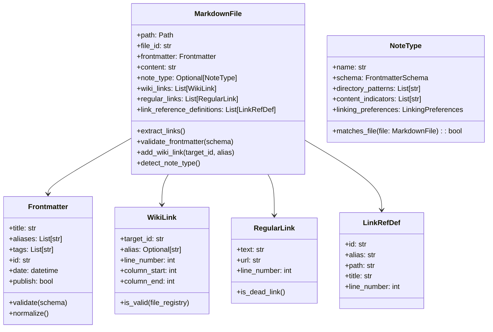

# Design Document

## Overview

The Knowledge Base Organizer is designed as a modular CLI application using Domain-Driven Design principles. The system processes Obsidian vaults by analyzing markdown files with YAML frontmatter, detecting WikiLinks and regular links, and providing quality improvement operations.

The architecture follows a clean architecture pattern with clear separation between domain logic, application services, and infrastructure concerns. The system is built for extensibility, allowing easy addition of new analysis and processing capabilities.

## Architecture

### High-Level Architecture


### Domain Model



## Components and Interfaces

### 1. CLI Interface Layer

**Technology:** Typer with Rich for enhanced output formatting

```python
# Main CLI commands structure
@app.command()
def validate_frontmatter(
    vault_path: Path,
    template: Optional[Path] = typer.Option(None, "--template", help="Template file to use as schema reference"),
    dry_run: bool = typer.Option(True, "--dry-run/--execute", help="Preview changes without applying them"),
    output_format: OutputFormat = typer.Option(OutputFormat.JSON, help="Output format"),
    include_patterns: Optional[List[str]] = typer.Option(None, "--include", help="Include file patterns"),
    exclude_patterns: Optional[List[str]] = typer.Option(None, "--exclude", help="Exclude file patterns"),
    verbose: bool = typer.Option(False, "--verbose", "-v", help="Show detailed output including type conversions")
) -> None:
    """Validate and fix frontmatter according to template schema

    When --template is specified, uses that template file's frontmatter as the schema.
    When --template is not specified, uses automatic template detection from template directories.

    Examples:
        # Validate using specific template
        validate-frontmatter /path/to/vault --template ~/vault/900_TemplaterNotes/new-fleeing-note.md

        # Apply fixes using template
        validate-frontmatter /path/to/vault --template ~/vault/900_TemplaterNotes/new-fleeing-note.md --execute

        # Legacy mode (auto-detect templates)
        validate-frontmatter /path/to/vault
    """

@app.command()
def auto_link(
    vault_path: Path,
    dry_run: bool = True,
    exclude_tables: bool = False,
    max_links_per_file: int = 50,
    output_format: OutputFormat = OutputFormat.JSON
) -> None:
    """Generate WikiLinks from plain text mentions"""

@app.command()
def detect_dead_links(
    vault_path: Path,
    output_format: OutputFormat = OutputFormat.JSON,
    check_external_links: bool = False
) -> None:
    """Detect and report dead WikiLinks and regular links"""

@app.command()
def aggregate(
    vault_path: Path,
    output_path: Path,
    tags: List[str] = None,
    search_pattern: str = None,
    deduplicate: bool = True
) -> None:
    """Aggregate notes based on criteria into single file"""
```

### 2. Application Layer - Use Cases

**Frontmatter Validation Use Case:**

```python
class FrontmatterValidationUseCase:
    def __init__(
        self,
        file_repository: FileRepository,
        validation_service: ValidationService,
        output_renderer: OutputRenderer
    ):
        self.file_repository = file_repository
        self.validation_service = validation_service
        self.output_renderer = output_renderer

    def execute(self, request: FrontmatterValidationRequest) -> FrontmatterValidationResult:
        # Load schema and files
        # Validate each file's frontmatter
        # Generate fixes for interactive/automatic mode
        # Apply changes if not dry-run
        # Return structured results
```

**Auto-Link Generation Use Case:**

```python
class AutoLinkGenerationUseCase:
    def __init__(
        self,
        file_repository: FileRepository,
        link_analysis_service: LinkAnalysisService,
        content_processing_service: ContentProcessingService,
        semantic_analysis_service: SemanticAnalysisService
    ):
        # Dependencies injection

    def execute(self, request: AutoLinkRequest) -> AutoLinkResult:
        # Build file registry (id -> file mapping)
        # For each file, find potential link candidates using LinkAnalysisService
        # Use SemanticAnalysisService to score candidates based on context
        # Handle disambiguation for ambiguous links
        # Exclude existing links, frontmatter, tables (if configured)
        # Generate WikiLinks with appropriate aliases based on confidence scores
        # Apply changes if not dry-run
        # Return link generation report
```

### 3. Domain Layer - Core Business Logic

**Link Analysis Service:**

```python
class LinkAnalysisService:
    def find_advanced_link_candidates(
        self,
        content: str,
        file_registry: Dict[str, MarkdownFile],
        exclusion_zones: List[TextRange]
    ) -> List[AdvancedLinkCandidate]:
        """Find text that could be converted to WikiLinks, enriched with semantic context and confidence scores."""

    def detect_dead_links(
        self,
        files: List[MarkdownFile],
        file_registry: Dict[str, MarkdownFile]
    ) -> List[DeadLink]:
        """Detect WikiLinks and regular links that are broken"""

    def calculate_link_density(self, file: MarkdownFile) -> LinkDensityMetrics:
        """Calculate various link metrics for a file"""
```

**Semantic Analysis Service:**

```python
class SemanticAnalysisService:
    def calculate_similarity(self, text1: str, text2: str) -> float:
        """Calculate semantic similarity between two texts using vector embeddings."""

    def get_embedding(self, text: str) -> List[float]:
        """Generate a vector embedding for a given text."""
```

**Content Processing Service:**

```python
class ContentProcessingService:
    def extract_exclusion_zones(self, content: str) -> List[TextRange]:
        """Extract areas where auto-linking should be avoided"""
        # WikiLinks: [[...]]
        # Regular links: [...](...)
        # Frontmatter: --- ... ---
        # Link Reference Definitions: [id|alias]: path "title"
        # Tables (if configured): | ... |

    def apply_wiki_links(
        self,
        content: str,
        link_candidates: List[LinkCandidate]
    ) -> str:
        """Apply WikiLink formatting to identified candidates"""

    def normalize_frontmatter(self, frontmatter: Frontmatter) -> Frontmatter:
        """Standardize frontmatter formatting and remove duplicates"""
```

### 4. Infrastructure Layer

**File Repository:**

```python
class FileRepository:
    def __init__(self, config: ProcessingConfig):
        self.config = config

    def load_vault(self, vault_path: Path) -> List[MarkdownFile]:
        """Load all markdown files matching include/exclude patterns"""

    def save_file(self, file: MarkdownFile, backup: bool = True) -> None:
        """Save file with optional backup creation"""

    def create_backup(self, file_path: Path) -> Path:
        """Create timestamped backup of file"""
```

**Configuration Management:**

```python
@dataclass
class ProcessingConfig:
    include_patterns: List[str] = field(default_factory=lambda: ["**/*.md"])
    exclude_patterns: List[str] = field(default_factory=list)
    frontmatter_schema: Dict[str, Any] = field(default_factory=dict)
    exclude_tables_from_linking: bool = False
    max_links_per_file: int = 50
    backup_enabled: bool = True

    @classmethod
    def from_file(cls, config_path: Path) -> 'ProcessingConfig':
        """Load configuration from YAML file"""
```

## Data Models for Semantic Linking

```python
@dataclass
class PotentialTarget:
    file_id: str
    title: str
    context_similarity: float

@dataclass
class AdvancedLinkCandidate:
    text: str
    position: TextPosition
    potential_targets: List[PotentialTarget]
    best_target: Optional[PotentialTarget]
    confidence_score: float
    requires_disambiguation: bool
```

## Data Models

### Core Entities

**MarkdownFile Entity:**

- Represents a single markdown file with all its metadata and content
- Handles parsing of frontmatter, content, and link extraction
- Provides methods for validation and modification

**Value Objects:**

- `Frontmatter`: Immutable representation of YAML frontmatter
- `WikiLink`: Represents [[id|alias]] or [[id]] links
- `RegularLink`: Represents [text](url) markdown links
- `LinkRefDef`: Represents Foam Link Reference Definitions

### Processing Results

```python
@dataclass
class ValidationResult:
    file_path: Path
    is_valid: bool
    missing_fields: List[str]
    invalid_fields: Dict[str, str]
    suggested_fixes: Dict[str, Any]

@dataclass
class LinkGenerationResult:
    file_path: Path
    links_added: List[WikiLink]
    candidates_found: int
    candidates_applied: int

@dataclass
class DeadLinkResult:
    file_path: Path
    dead_wiki_links: List[WikiLink]
    dead_regular_links: List[RegularLink]
    suggested_fixes: List[str]
```

## Error Handling

### Exception Hierarchy

```python
class KnowledgeBaseOrganizerError(Exception):
    """Base exception for all organizer operations"""

class FileProcessingError(KnowledgeBaseOrganizerError):
    """Raised when file processing fails"""
    def __init__(self, file_path: Path, original_error: Exception):
        self.file_path = file_path
        self.original_error = original_error

class FrontmatterValidationError(KnowledgeBaseOrganizerError):
    """Raised when frontmatter validation fails"""

class ConfigurationError(KnowledgeBaseOrganizerError):
    """Raised when configuration is invalid"""

class LinkProcessingError(KnowledgeBaseOrganizerError):
    """Raised when link processing fails"""
```

### Error Recovery Strategy

1. **File-level errors**: Log error and continue processing other files
2. **Validation errors**: Collect all issues and report at the end
3. **Configuration errors**: Fail fast with clear error messages
4. **I/O errors**: Retry with exponential backoff for transient issues

## Testing Strategy

### Unit Testing

**Domain Layer Testing:**

- Test all business logic in isolation
- Use property-based testing for link detection algorithms
- Mock external dependencies (file system, configuration)

**Application Layer Testing:**

- Test use case orchestration
- Verify proper error handling and result formatting
- Test dry-run vs. actual execution modes

### Integration Testing

**File Processing Integration:**

- Test with real markdown files from test vault
- Verify end-to-end processing workflows
- Test backup and recovery mechanisms

**CLI Integration:**

- Test all CLI commands with various parameter combinations
- Verify output formatting (JSON, CSV, console)
- Test progress reporting and error messages

### Test Data Strategy

**Test Vault Structure:**

```
tests/test-data/vaults/
├── test-myvault/           # Real sample data
├── minimal-vault/          # Minimal test cases
├── edge-cases-vault/       # Edge cases and error conditions
└── performance-vault/      # Large dataset for performance testing
```

**Test Categories:**

1. **Valid cases**: Proper frontmatter, valid links, standard content
2. **Invalid cases**: Malformed frontmatter, broken links, edge cases
3. **Edge cases**: Empty files, special characters, large files
4. **Performance cases**: Large vaults, many links, complex content

### Continuous Integration

**Test Execution:**

- Run full test suite on every commit
- Performance benchmarks on release candidates
- Integration tests with multiple Python versions

**Quality Gates:**

- Minimum 90% code coverage
- All linting rules pass (ruff, mypy)
- No security vulnerabilities (bandit)
- Performance regression detection

## Template-Based Schema Management

### Overview

The system uses template files as the Single Source of Truth (SSoT) for frontmatter schemas. Instead of maintaining separate schema definitions, the system extracts schema rules directly from template files in designated directories (e.g., `900_TemplaterNotes`, `903_BookSearchTemplates`).

### Template Schema Extraction

**Template Schema Repository:**

```python
class TemplateSchemaRepository:
    def __init__(self, vault_path: Path, config: ProcessingConfig):
        self.vault_path = vault_path
        self.config = config

    def extract_schemas_from_templates(self) -> Dict[str, FrontmatterSchema]:
        """Extract frontmatter schemas from template files"""
        schemas = {}

        for template_dir in self.config.template_directories:
            template_path = self.vault_path / template_dir
            if template_path.exists():
                for template_file in template_path.glob("*.md"):
                    schema = self._parse_template_schema(template_file)
                    schemas[template_file.stem] = schema

        return schemas

    def extract_schema_from_single_template(self, template_path: Path) -> FrontmatterSchema:
        """Extract schema from a single template file specified via --template option"""
        if not template_path.exists():
            raise TemplateNotFoundError(f"Template file not found: {template_path}")

        return self._parse_template_schema(template_path)

    def _parse_template_schema(self, template_path: Path) -> FrontmatterSchema:
        """Parse a template file and extract schema rules"""
        # Parse frontmatter from template
        # Convert template variables to schema field definitions
        # Handle Templater syntax: <% tp.file.cursor(1) %>, {{variable}}
        # Define required vs optional fields
        # Extract field types and validation rules

    def detect_template_type(self, file: MarkdownFile) -> Optional[str]:
        """Detect which template a file should conform to"""
        # Analyze file location (directory structure)
        # Check existing frontmatter patterns
        # Match against known template characteristics
        # Return best matching template name
```

### Type Conversion System

**Type Converter for YAML Compatibility:**

```python
class YAMLTypeConverter:
    def __init__(self, config: ProcessingConfig):
        self.config = config
        self.conversion_rules = self._load_conversion_rules()

    def convert_frontmatter_types(
        self,
        frontmatter: Dict[str, Any],
        schema: FrontmatterSchema
    ) -> Tuple[Dict[str, Any], List[TypeConversion]]:
        """Convert YAML types to match schema expectations"""
        converted = {}
        conversions = []

        for field_name, value in frontmatter.items():
            if field_name in schema.fields:
                expected_type = schema.fields[field_name].field_type
                converted_value, conversion = self._convert_field_value(
                    field_name, value, expected_type
                )
                converted[field_name] = converted_value
                if conversion:
                    conversions.append(conversion)
            else:
                # Preserve unknown fields as-is
                converted[field_name] = value

        return converted, conversions

    def _convert_field_value(
        self,
        field_name: str,
        value: Any,
        expected_type: Type
    ) -> Tuple[Any, Optional[TypeConversion]]:
        """Convert individual field value to expected type"""
        original_value = value
        original_type = type(value).__name__

        # Handle special cases first
        if field_name == 'id' and isinstance(value, int):
            # Convert integer ID to string
            converted_value = str(value)
        elif field_name in ['date', 'published'] and hasattr(value, 'isoformat'):
            # Convert datetime objects to ISO string
            converted_value = value.isoformat()
        elif expected_type == str and not isinstance(value, str):
            # Convert any non-string to string
            converted_value = str(value) if value is not None else None
        elif expected_type == list and not isinstance(value, list):
            # Convert single values to list
            converted_value = [value] if value is not None else []
        else:
            # No conversion needed
            converted_value = value

        # Create conversion record if value changed
        conversion = None
        if converted_value != original_value:
            conversion = TypeConversion(
                field_name=field_name,
                original_value=original_value,
                original_type=original_type,
                converted_value=converted_value,
                converted_type=type(converted_value).__name__
            )

        return converted_value, conversion

@dataclass
class TypeConversion:
    field_name: str
    original_value: Any
    original_type: str
    converted_value: Any
    converted_type: str
```

### Template Schema Rules

**Schema Field Types:**

```python
@dataclass
class SchemaField:
    name: str
    field_type: Type  # str, List[str], datetime, bool, etc.
    required: bool
    default_value: Optional[Any] = None
    validation_pattern: Optional[str] = None  # regex for validation
    template_variable: Optional[str] = None  # original template variable

@dataclass
class FrontmatterSchema:
    template_name: str
    template_path: Path
    fields: Dict[str, SchemaField]
    required_fields: Set[str]
    optional_fields: Set[str]

    def validate_frontmatter(self, frontmatter: Frontmatter) -> ValidationResult:
        """Validate frontmatter against this schema"""

    def suggest_fixes(self, frontmatter: Frontmatter) -> List[FieldFix]:
        """Suggest fixes for non-conforming frontmatter"""
```

### Template Detection Logic

**Detection Strategies:**

1. **Directory-based detection**: Files in certain directories follow specific templates
   - `100_FleetingNotes/` → `new-fleeing-note.md` template
   - `104_Books/` → `booksearchtemplate.md` template

2. **Content-based detection**: Analyze existing frontmatter patterns
   - Presence of `isbn13`, `publisher` → Book template
   - Presence of `published`, `category` → Fleeting note template

3. **Explicit template specification**: Allow manual template assignment

**Template Mapping Configuration:**

```yaml
# config.yaml
template_detection:
  directory_mappings:
    "100_FleetingNotes": "new-fleeing-note"
    "104_Books": "booksearchtemplate"

  field_patterns:
    book_indicators: ["isbn13", "publisher", "author", "totalPage"]
    note_indicators: ["published", "category", "description"]

  fallback_template: "new-fleeing-note"
```

### Template Variable Processing

**Templater Syntax Handling:**

- `<% tp.file.cursor(1) %>` → Required string field
- `<% tp.file.creation_date("YYYYMMDDHHmmss") %>` → Auto-generated ID field
- `<% tp.file.creation_date("YYYY-MM-DD") %>` → Auto-generated date field

**Book Search Template Variables:**

- `{{title}}` → Required string field
- `{{author}}` → Required string/array field
- `{{isbn13}}` → Optional string field with ISBN validation

### Enhanced Validation Use Case

**Updated Template-Based Frontmatter Validation:**

```python
class FrontmatterValidationUseCase:
    def __init__(
        self,
        file_repository: FileRepository,
        template_schema_repository: TemplateSchemaRepository,
        validation_service: ValidationService,
        type_converter: YAMLTypeConverter
    ):
        self.file_repository = file_repository
        self.template_schema_repository = template_schema_repository
        self.validation_service = validation_service
        self.type_converter = type_converter

    def execute(self, request: FrontmatterValidationRequest) -> FrontmatterValidationResult:
        # Handle template-based validation (new behavior)
        if request.template_path:
            return self._execute_template_based_validation(request)

        # Handle legacy validation (existing behavior)
        return self._execute_legacy_validation(request)

    def _execute_template_based_validation(
        self,
        request: FrontmatterValidationRequest
    ) -> FrontmatterValidationResult:
        """Execute validation using specified template file"""
        # 1. Extract schema from specified template file
        schema = self.template_schema_repository.extract_schema_from_single_template(
            request.template_path
        )

        # 2. Load all markdown files from vault
        files = self.file_repository.load_vault(request.vault_path)

        results = []
        for file in files:
            # 3. Apply type conversion to handle YAML automatic conversion
            converted_frontmatter, type_conversions = self.type_converter.convert_frontmatter_types(
                file.frontmatter.to_dict(), schema
            )

            # 4. Create updated file with converted frontmatter
            updated_file = file.with_frontmatter(Frontmatter.from_dict(converted_frontmatter))

            # 5. Validate against template schema
            validation_result = schema.validate_frontmatter(updated_file.frontmatter)

            # 6. Generate fixes if needed
            fixes = []
            if not validation_result.is_valid or type_conversions:
                fixes = schema.suggest_fixes(updated_file.frontmatter)

                # 7. Apply fixes if execute mode
                if request.execute_mode and (fixes or type_conversions):
                    self._apply_fixes_and_conversions(file, fixes, type_conversions)

            results.append(ValidationResult(
                file_path=file.path,
                template_type=request.template_path.stem,
                validation_result=validation_result,
                type_conversions=type_conversions,
                fixes_applied=fixes if request.execute_mode else [],
                would_be_modified=bool(fixes or type_conversions)
            ))

        return FrontmatterValidationResult(
            results=results,
            template_used=request.template_path,
            schema_used=schema
        )

    def _execute_legacy_validation(
        self,
        request: FrontmatterValidationRequest
    ) -> FrontmatterValidationResult:
        """Execute legacy validation (existing behavior)"""
        # 1. Extract schemas from template directories (existing behavior)
        schemas = self.template_schema_repository.extract_schemas_from_templates()

        # 2. Load all markdown files from vault
        files = self.file_repository.load_vault(request.vault_path)

        results = []
        for file in files:
            # 3. Detect appropriate template type for each file
            template_type = self.template_schema_repository.detect_template_type(file)

            if template_type and template_type in schemas:
                schema = schemas[template_type]

                # 4. Apply type conversion
                converted_frontmatter, type_conversions = self.type_converter.convert_frontmatter_types(
                    file.frontmatter.to_dict(), schema
                )

                # 5. Validate frontmatter against detected template schema
                updated_file = file.with_frontmatter(Frontmatter.from_dict(converted_frontmatter))
                validation_result = schema.validate_frontmatter(updated_file.frontmatter)

                # 6. Generate fixes if needed
                fixes = []
                if not validation_result.is_valid or type_conversions:
                    fixes = schema.suggest_fixes(updated_file.frontmatter)

                    # 7. Apply fixes if not dry-run
                    if request.execute_mode:
                        self._apply_fixes_and_conversions(file, fixes, type_conversions)

                results.append(ValidationResult(
                    file_path=file.path,
                    template_type=template_type,
                    validation_result=validation_result,
                    type_conversions=type_conversions,
                    fixes_applied=fixes if request.execute_mode else []
                ))

        return FrontmatterValidationResult(results=results, schemas_used=schemas)

    def _apply_fixes_and_conversions(
        self,
        file: MarkdownFile,
        fixes: List[FieldFix],
        type_conversions: List[TypeConversion]
    ) -> None:
        """Apply both fixes and type conversions to file"""
        # Apply type conversions first
        updated_frontmatter = file.frontmatter.to_dict()
        for conversion in type_conversions:
            updated_frontmatter[conversion.field_name] = conversion.converted_value

        # Apply fixes
        for fix in fixes:
            updated_frontmatter[fix.field_name] = fix.suggested_value

        # Save updated file
        updated_file = file.with_frontmatter(Frontmatter.from_dict(updated_frontmatter))
        self.file_repository.save_file(updated_file, backup=True)
```

### Benefits of Template-Based Approach

1. **Single Source of Truth**: Templates serve as both documentation and validation rules
2. **Automatic Synchronization**: Schema changes in templates automatically update validation
3. **Real-world Accuracy**: Schemas reflect actual template usage patterns
4. **Maintainability**: No separate schema files to maintain
5. **Flexibility**: Easy to add new templates or modify existing ones
6. **User-friendly**: Users work with familiar template files, not abstract schemas

## Advanced WikiLink Detection for Japanese

### Overview

The system provides intelligent WikiLink detection that handles Japanese language variations, synonyms, and alternative spellings. This feature automatically creates links between semantically related terms and maintains bidirectional alias relationships.

### Japanese Language Processing

**Synonym Detection Service:**

```python
class JapaneseSynonymService:
    def __init__(self, config: ProcessingConfig):
        self.config = config
        self.synonym_patterns = self._load_synonym_patterns()
        self.variation_rules = self._load_variation_rules()

    def find_synonyms(self, text: str, file_registry: Dict[str, MarkdownFile]) -> List[SynonymMatch]:
        """Find potential synonym matches in text"""
        matches = []

        # 1. Direct alias matching (existing functionality)
        matches.extend(self._find_direct_matches(text, file_registry))

        # 2. Katakana variation matching
        matches.extend(self._find_katakana_variations(text, file_registry))

        # 3. Common synonym patterns
        matches.extend(self._find_common_synonyms(text, file_registry))

        # 4. Inflection and conjugation matching
        matches.extend(self._find_inflection_matches(text, file_registry))

        return matches

    def suggest_alias_additions(self, matches: List[SynonymMatch]) -> List[AliasAddition]:
        """Suggest bidirectional alias additions"""
        # When "インターフェイス" matches "インターフェース" file
        # Suggest adding "インターフェイス" to target file's aliases
        # Suggest creating WikiLink in source file
```

**Synonym Pattern Definitions:**

```python
@dataclass
class SynonymPattern:
    pattern_type: str  # "katakana_variation", "common_synonym", "inflection"
    source_pattern: str  # regex or exact match
    target_patterns: List[str]  # possible variations
    confidence: float  # matching confidence (0.0-1.0)

@dataclass
class SynonymMatch:
    source_text: str  # text found in content
    target_file: MarkdownFile  # file to link to
    target_alias: str  # specific alias to use
    match_type: str  # type of synonym match
    confidence: float
    position: TextPosition  # location in source file
```

### Katakana Variation Handling

**Common Katakana Variations:**

```python
class KatakanaVariationDetector:
    # Long vowel variations
    LONG_VOWEL_PATTERNS = {
        'ー': ['', 'ウ', 'ー'],  # インターフェース ↔ インターフェイス
        'ウ': ['ー', '', 'ウ'],
    }

    # Consonant variations
    CONSONANT_PATTERNS = {
        'ヴ': ['ブ', 'バ'],  # サーヴィス ↔ サービス
        'ティ': ['チ'],      # パーティー ↔ パーチー
        'ディ': ['デ'],      # ディレクトリ ↔ デレクトリ
    }

    def generate_variations(self, katakana_text: str) -> List[str]:
        """Generate possible katakana variations"""
        variations = [katakana_text]

        # Apply long vowel variations
        for original, replacements in self.LONG_VOWEL_PATTERNS.items():
            for replacement in replacements:
                if original in katakana_text:
                    variation = katakana_text.replace(original, replacement)
                    variations.append(variation)

        # Apply consonant variations
        for original, replacements in self.CONSONANT_PATTERNS.items():
            for replacement in replacements:
                if original in katakana_text:
                    variation = katakana_text.replace(original, replacement)
                    variations.append(variation)

        return list(set(variations))  # Remove duplicates
```

### Common Synonym Patterns

**Technical Term Synonyms:**

```yaml
# synonym_patterns.yaml
technical_synonyms:
  - source: ["インターフェイス", "インターフェース"]
    confidence: 0.95
  - source: ["データベース", "DB", "ＤＢ"]
    confidence: 0.90
  - source: ["アプリケーション", "アプリ", "アプリケーション"]
    confidence: 0.85
  - source: ["サーバー", "サーバ"]
    confidence: 0.95
  - source: ["ユーザー", "ユーザ"]
    confidence: 0.95

english_japanese_pairs:
  - english: "interface"
    japanese: ["インターフェース", "インターフェイス"]
    confidence: 0.80
  - english: "server"
    japanese: ["サーバー", "サーバ"]
    confidence: 0.80
```

### Enhanced Link Analysis Service

**Updated Link Analysis with Synonym Support:**

```python
class EnhancedLinkAnalysisService:
    def __init__(
        self,
        synonym_service: JapaneseSynonymService,
        config: ProcessingConfig
    ):
        self.synonym_service = synonym_service
        self.config = config

    def find_advanced_link_candidates(
        self,
        content: str,
        file_registry: Dict[str, MarkdownFile],
        exclusion_zones: List[TextRange]
    ) -> List[AdvancedLinkCandidate]:
        """Find link candidates including synonym matches"""

        candidates = []

        # 1. Standard exact matching (existing)
        candidates.extend(self._find_exact_matches(content, file_registry, exclusion_zones))

        # 2. Synonym matching
        synonym_matches = self.synonym_service.find_synonyms(content, file_registry)
        for match in synonym_matches:
            if self._is_in_exclusion_zone(match.position, exclusion_zones):
                continue

            candidate = AdvancedLinkCandidate(
                source_text=match.source_text,
                target_file=match.target_file,
                suggested_alias=match.target_alias,
                match_type=match.match_type,
                confidence=match.confidence,
                position=match.position,
                requires_alias_addition=True  # Need to add alias to target
            )
            candidates.append(candidate)

        # 3. Sort by confidence and position
        return sorted(candidates, key=lambda x: (-x.confidence, x.position.start))

    def generate_bidirectional_updates(
        self,
        candidates: List[AdvancedLinkCandidate]
    ) -> List[FileUpdate]:
        """Generate updates for both source and target files"""
        updates = []

        for candidate in candidates:
            # Update source file: add WikiLink
            source_update = FileUpdate(
                file_path=candidate.source_file.path,
                update_type="add_wikilink",
                content_change=self._create_wikilink_replacement(candidate),
                position=candidate.position
            )
            updates.append(source_update)

            # Update target file: add alias if needed
            if candidate.requires_alias_addition:
                target_update = FileUpdate(
                    file_path=candidate.target_file.path,
                    update_type="add_alias",
                    frontmatter_change={
                        "aliases": candidate.target_file.frontmatter.aliases + [candidate.source_text]
                    }
                )
                updates.append(target_update)

        return updates
```

### Configuration for Advanced Detection

**Enhanced Processing Config:**

```python
@dataclass
class AdvancedProcessingConfig(ProcessingConfig):
    # Synonym detection settings
    enable_synonym_detection: bool = True
    enable_katakana_variations: bool = True
    enable_english_japanese_matching: bool = True
    minimum_confidence_threshold: float = 0.7

    # Bidirectional alias management
    auto_add_aliases: bool = True
    max_aliases_per_file: int = 20

    # Language-specific settings
    synonym_patterns_file: Optional[Path] = None
    custom_variation_rules: Dict[str, List[str]] = field(default_factory=dict)

    # Performance settings
    max_synonym_candidates_per_file: int = 100
    enable_fuzzy_matching: bool = False
    fuzzy_matching_threshold: float = 0.8
```

### Example Workflow

**Synonym Detection and Linking Process:**

1. **Text Analysis**: "このインターフェイスは使いやすい"
2. **Synonym Detection**: Find file with title "インターフェース" and aliases ["interface"]
3. **Match Generation**:
   - Source: "インターフェイス" (in content)
   - Target: File "20230101120000.md" (title: "インターフェース")
   - Confidence: 0.95 (katakana variation)
4. **Bidirectional Update**:
   - Source file: Replace "インターフェイス" → "[[20230101120000|インターフェイス]]"
   - Target file: Add "インターフェイス" to aliases list
5. **Result**: Both files now reference each other correctly

### Performance Considerations

**Optimization Strategies:**

- **Caching**: Cache synonym patterns and file registry for repeated operations
- **Indexing**: Build inverted index of all aliases and titles for fast lookup
- **Batching**: Process multiple files in batches to amortize setup costs
- **Filtering**: Apply confidence thresholds early to reduce processing overhead
- **Parallel Processing**: Use multiprocessing for large vaults with many files

**Memory Management:**

- Stream processing for large files
- Lazy loading of synonym patterns
- Garbage collection of intermediate results
- Configurable batch sizes based on available memory

## Enhanced Architecture for Second Brain Automation

### Semantic Analysis Infrastructure

**Embedding Service Architecture:**

```python
class SemanticAnalysisService:
    def __init__(self, model_name: str = "sentence-transformers/all-MiniLM-L6-v2"):
        self.model = SentenceTransformer(model_name)
        self.embedding_cache = EmbeddingCache()
        self.context_analyzer = ContextAnalyzer()

    def get_document_embedding(self, content: str) -> np.ndarray:
        """Generate embedding for entire document"""

    def get_section_embeddings(self, content: str) -> Dict[str, np.ndarray]:
        """Generate embeddings for each section (header-delimited)"""

    def calculate_contextual_similarity(
        self,
        source_context: str,
        target_content: str,
        context_window: int = 3
    ) -> float:
        """Calculate similarity with contextual awareness"""

    def analyze_domain_context(self, content: str) -> DomainContext:
        """Determine domain/topic context for better disambiguation"""
```

### Intelligent Frontmatter Enhancement

**Content Analysis Pipeline:**

```python
class IntelligentFrontmatterEnhancer:
    def __init__(
        self,
        semantic_service: SemanticAnalysisService,
        tag_pattern_manager: TagPatternManager,
        content_analyzer: ContentAnalysisService
    ):
        self.semantic_service = semantic_service
        self.tag_pattern_manager = tag_pattern_manager
        self.content_analyzer = content_analyzer

    def enhance_frontmatter(
        self,
        file: MarkdownFile,
        vault_context: VaultContext
    ) -> FrontmatterEnhancement:
        """Generate intelligent frontmatter enhancements"""

        # 1. Extract key concepts and suggest tags
        concepts = self.content_analyzer.extract_key_concepts(file.content)
        suggested_tags = self.tag_pattern_manager.suggest_tags(concepts, vault_context)

        # 2. Generate description if missing
        description = self._generate_description(file.content) if not file.frontmatter.description else None

        # 3. Find related notes and suggest aliases
        related_notes = self._find_related_notes(file, vault_context)
        suggested_aliases = self._suggest_bidirectional_aliases(file, related_notes)

        # 4. Apply directory-specific rules
        directory_enhancements = self._apply_directory_rules(file.path, vault_context)

        return FrontmatterEnhancement(
            suggested_tags=suggested_tags,
            generated_description=description,
            suggested_aliases=suggested_aliases,
            directory_enhancements=directory_enhancements,
            confidence_scores=self._calculate_confidence_scores(...)
        )
```

### Relationship Discovery System

**Conceptual Relationship Engine:**

```python
class RelationshipDiscoveryService:
    def __init__(
        self,
        semantic_service: SemanticAnalysisService,
        link_analysis_service: LinkAnalysisService
    ):
        self.semantic_service = semantic_service
        self.link_analysis_service = link_analysis_service

    def discover_relationships(
        self,
        vault: List[MarkdownFile]
    ) -> List[ConceptualRelationship]:
        """Discover conceptual relationships between notes"""

        # 1. Build semantic similarity matrix
        similarity_matrix = self._build_similarity_matrix(vault)

        # 2. Identify clusters and themes
        clusters = self._identify_content_clusters(similarity_matrix)

        # 3. Find implicit references
        implicit_refs = self._find_implicit_references(vault)

        # 4. Detect content gaps and opportunities
        gaps = self._detect_content_gaps(clusters, vault)

        return self._generate_relationship_suggestions(
            clusters, implicit_refs, gaps
        )

    def create_bidirectional_links(
        self,
        relationships: List[ConceptualRelationship],
        confidence_threshold: float = 0.7
    ) -> List[FileUpdate]:
        """Create bidirectional links for high-confidence relationships"""
```

### Japanese Language Processing Enhancement

**Advanced Japanese Language Service:**

```python
class AdvancedJapaneseLanguageService:
    def __init__(self):
        self.katakana_processor = KatakanaVariationProcessor()
        self.english_japanese_mapper = EnglishJapaneseMapper()
        self.compound_analyzer = CompoundWordAnalyzer()
        self.honorific_handler = HonorificVariationHandler()

    def find_japanese_variations(
        self,
        text: str,
        file_registry: Dict[str, MarkdownFile]
    ) -> List[JapaneseVariationMatch]:
        """Find all Japanese language variations and matches"""

        matches = []

        # 1. Katakana variations (インターフェース ↔ インターフェイス)
        matches.extend(self.katakana_processor.find_variations(text, file_registry))

        # 2. English-Japanese pairs (API ↔ エーピーアイ)
        matches.extend(self.english_japanese_mapper.find_pairs(text, file_registry))

        # 3. Compound word components (データベース → DB, database)
        matches.extend(self.compound_analyzer.find_components(text, file_registry))

        # 4. Honorific variations (です/である forms)
        matches.extend(self.honorific_handler.find_variations(text, file_registry))

        return self._rank_by_confidence(matches)

    def suggest_japanese_aliases(
        self,
        file: MarkdownFile,
        vault_context: VaultContext
    ) -> List[JapaneseAliassuggestion]:
        """Suggest Japanese aliases based on content analysis"""
```

### Automated Maintenance Engine

**Continuous Maintenance Architecture:**

```python
class AutomatedMaintenanceEngine:
    def __init__(
        self,
        relationship_service: RelationshipDiscoveryService,
        quality_analyzer: ContentQualityAnalyzer,
        structural_optimizer: StructuralOptimizer
    ):
        self.relationship_service = relationship_service
        self.quality_analyzer = quality_analyzer
        self.structural_optimizer = structural_optimizer

    def run_maintenance_cycle(
        self,
        vault: List[MarkdownFile],
        maintenance_config: MaintenanceConfig
    ) -> MaintenanceReport:
        """Run a complete maintenance cycle"""

        report = MaintenanceReport()

        # 1. Fix broken references
        broken_refs = self._detect_broken_references(vault)
        fixed_refs = self._auto_fix_references(broken_refs)
        report.add_fixes("broken_references", fixed_refs)

        # 2. Merge duplicate notes
        duplicates = self.quality_analyzer.find_duplicates(vault)
        merges = self._suggest_merges(duplicates)
        report.add_suggestions("duplicate_merges", merges)

        # 3. Consolidate tags
        tag_issues = self._analyze_tag_consistency(vault)
        tag_fixes = self._consolidate_tags(tag_issues)
        report.add_fixes("tag_consolidation", tag_fixes)

        # 4. Connect orphaned notes
        orphans = self._find_orphaned_notes(vault)
        connections = self.relationship_service.suggest_connections(orphans)
        report.add_suggestions("orphan_connections", connections)

        # 5. Optimize structure
        structural_issues = self.structural_optimizer.analyze_structure(vault)
        optimizations = self.structural_optimizer.suggest_improvements(structural_issues)
        report.add_suggestions("structural_optimizations", optimizations)

        return report
```

### Contextual Intelligence Framework

**Advanced Context Analysis:**

```python
class ContextualIntelligenceService:
    def __init__(
        self,
        semantic_service: SemanticAnalysisService,
        domain_classifier: DomainClassifier
    ):
        self.semantic_service = semantic_service
        self.domain_classifier = domain_classifier

    def analyze_link_context(
        self,
        candidate: LinkCandidate,
        source_file: MarkdownFile,
        target_file: MarkdownFile
    ) -> ContextualAnalysis:
        """Perform deep contextual analysis for link candidates"""

        # 1. Extract surrounding context (3 paragraphs)
        source_context = self._extract_context_window(
            candidate.position, source_file.content, window_size=3
        )

        # 2. Classify domain/topic
        source_domain = self.domain_classifier.classify(source_context)
        target_domain = self.domain_classifier.classify(target_file.content)

        # 3. Calculate semantic similarity with context
        similarity = self.semantic_service.calculate_contextual_similarity(
            source_context, target_file.content
        )

        # 4. Check for disambiguation needs
        disambiguation_needed = self._check_disambiguation_needs(
            candidate.text, source_domain, target_domain
        )

        # 5. Generate confidence score
        confidence = self._calculate_contextual_confidence(
            similarity, source_domain, target_domain, disambiguation_needed
        )

        return ContextualAnalysis(
            similarity_score=similarity,
            source_domain=source_domain,
            target_domain=target_domain,
            confidence_score=confidence,
            disambiguation_needed=disambiguation_needed,
            reasoning=self._generate_reasoning(...)
        )
```

### Integration Architecture

**Unified Second Brain Automation:**

```python
class SecondBrainAutomationOrchestrator:
    """Orchestrates all automation features for seamless second brain maintenance"""

    def __init__(self, config: AutomationConfig):
        self.semantic_service = SemanticAnalysisService(config.model_name)
        self.frontmatter_enhancer = IntelligentFrontmatterEnhancer(...)
        self.relationship_discoverer = RelationshipDiscoveryService(...)
        self.japanese_processor = AdvancedJapaneseLanguageService()
        self.maintenance_engine = AutomatedMaintenanceEngine(...)
        self.contextual_intelligence = ContextualIntelligenceService(...)

    def run_full_automation(
        self,
        vault_path: Path,
        automation_level: AutomationLevel = AutomationLevel.CONSERVATIVE
    ) -> AutomationReport:
        """Run complete second brain automation"""

        # 1. Load and analyze vault
        vault = self._load_vault(vault_path)

        # 2. Enhance frontmatter intelligently
        frontmatter_enhancements = self.frontmatter_enhancer.enhance_all(vault)

        # 3. Discover and create relationships
        relationships = self.relationship_discoverer.discover_relationships(vault)

        # 4. Process Japanese content
        japanese_enhancements = self.japanese_processor.enhance_japanese_content(vault)

        # 5. Create contextually intelligent links
        intelligent_links = self._create_contextual_links(vault)

        # 6. Run maintenance cycle
        maintenance_report = self.maintenance_engine.run_maintenance_cycle(vault)

        # 7. Apply changes based on automation level
        applied_changes = self._apply_changes(
            frontmatter_enhancements,
            relationships,
            japanese_enhancements,
            intelligent_links,
            maintenance_report,
            automation_level
        )

        return AutomationReport(
            vault_path=vault_path,
            changes_applied=applied_changes,
            suggestions_pending=self._get_pending_suggestions(),
            quality_metrics=self._calculate_quality_metrics(vault),
            automation_level=automation_level
        )
```

This enhanced architecture transforms the knowledge base organizer into a true "second brain" automation system that can intelligently maintain, enhance, and interconnect your Obsidian vault with minimal manual intervention.

## 🚀 段階的実装戦略

### Phase 12: セマンティック分析基盤 (最優先)

**既存コード活用アプローチ:**

```python
# 既存のLinkAnalysisServiceを拡張
class LinkAnalysisService:
    def __init__(self, exclude_tables: bool = False, semantic_service: SemanticAnalysisService = None):
        self.exclude_tables = exclude_tables
        self.semantic_service = semantic_service  # 新規追加

    def find_link_candidates(self, content: str, file_registry: dict) -> list[LinkCandidate]:
        # 既存のロジック
        basic_candidates = self._find_basic_candidates(content, file_registry)

        # セマンティック分析を追加（オプション）
        if self.semantic_service:
            enhanced_candidates = self._enhance_with_semantics(basic_candidates, content)
            return enhanced_candidates

        return basic_candidates
```

**新規実装が必要な最小限のコンポーネント:**

```python
# 新規: 軽量セマンティック分析サービス
class SemanticAnalysisService:
    def __init__(self, model_name: str = "all-MiniLM-L6-v2"):
        from sentence_transformers import SentenceTransformer
        self.model = SentenceTransformer(model_name)
        self.cache = {}  # シンプルなメモリキャッシュ

    def calculate_similarity(self, text1: str, text2: str) -> float:
        """基本的なコサイン類似度計算"""
        if (text1, text2) in self.cache:
            return self.cache[(text1, text2)]

        embeddings = self.model.encode([text1, text2])
        similarity = cosine_similarity([embeddings[0]], [embeddings[1]])[0][0]
        self.cache[(text1, text2)] = similarity
        return similarity
```

### Phase 13: 日本語処理強化

**既存のTagPatternManagerを拡張:**

```python
# 既存のTagPatternManagerに日本語機能を追加
class TagPatternManager:
    def __init__(self, config_dir: Path = None):
        # 既存の初期化
        self.japanese_processor = JapaneseVariationProcessor()  # 新規追加

    def find_tag_suggestions(self, content: str) -> list[str]:
        # 既存のロジック
        basic_suggestions = self._find_basic_suggestions(content)

        # 日本語バリエーション処理を追加
        japanese_suggestions = self.japanese_processor.find_variations(content)

        return basic_suggestions + japanese_suggestions

# 新規: 日本語バリエーション処理
class JapaneseVariationProcessor:
    def __init__(self):
        self.katakana_patterns = {
            'ー': ['', 'ウ', 'ー'],  # インターフェース ↔ インターフェイス
            'ヴ': ['ブ', 'バ'],     # サーヴィス ↔ サービス
        }

    def find_variations(self, text: str) -> list[str]:
        """カタカナ表記ゆれを検出"""
        variations = []
        # 実装詳細...
        return variations
```

### Phase 14: インテリジェントfrontmatter強化

**既存のFrontmatterEnhancementServiceを拡張:**

```python
# 既存のFrontmatterEnhancementServiceにAI機能を追加
class FrontmatterEnhancementService:
    def __init__(self, config_dir: Path = None, semantic_service: SemanticAnalysisService = None):
        # 既存の初期化
        self.semantic_service = semantic_service  # 新規追加

    def enhance_frontmatter(self, file: MarkdownFile, vault_context: dict = None) -> EnhancementResult:
        # 既存のロジック
        basic_enhancements = self._basic_enhancement(file)

        # セマンティック強化を追加（オプション）
        if self.semantic_service and vault_context:
            semantic_enhancements = self._semantic_enhancement(file, vault_context)
            return self._merge_enhancements(basic_enhancements, semantic_enhancements)

        return basic_enhancements
```

### 実装の利点

1. **既存コードの保護**: 既存の機能は一切破壊しない
2. **段階的導入**: 各機能はオプションとして追加
3. **後方互換性**: 既存のCLIコマンドは変更なしで動作
4. **テスト容易性**: 新機能は独立してテスト可能
5. **パフォーマンス**: AI機能は必要時のみ有効化

### 依存関係の最小化

```toml
# pyproject.toml - 段階的依存関係追加
[project]
dependencies = [
    "pydantic>=2.11.9",
    "typer>=0.19.2",
    "rich>=13.0.0",
    "pyyaml>=6.0.0",
    # Phase 12で追加
    "sentence-transformers>=2.2.0",  # セマンティック分析用
    "scikit-learn>=1.3.0",          # コサイン類似度計算用
]
```

この段階的アプローチにより、既存の安定した機能を保持しながら、高度なAI機能を段階的に追加できます。

## 🚀 Phase 15: ollama/LLM活用AI基盤 (高優先・軽量)

### 戦略1: Vector DB (RAG基盤) + 戦略2: オンデマンドLLM

**理由**: ollama + faiss-cpuによる軽量AI基盤で、重い依存関係なしでセマンティック分析とLLM推論を実現。

### AI Services Domain Interface

```python
# src/knowledge_base_organizer/domain/services/ai_services.py
from abc import ABC, abstractmethod
from typing import List, Tuple, Dict, Any

class EmbeddingService(ABC):
    """テキストをベクトル化するサービス"""
    @abstractmethod
    def create_embedding(self, text: str) -> List[float]:
        pass

class VectorStore(ABC):
    """ベクトルを保存・検索する組み込み型サービス"""
    @abstractmethod
    def index_document(self, doc_id: str, vector: List[float]):
        pass

    @abstractmethod
    def search(self, query_vector: List[float], k: int) -> List[Tuple[str, float]]:
        pass

    @abstractmethod
    def save(self, path: str):
        pass

    @abstractmethod
    def load(self, path: str):
        pass

class LLMService(ABC):
    """オンデマンドでLLM推論を実行するサービス"""
    @abstractmethod
    def suggest_metadata(self, content: str) -> Dict[str, Any]:
        pass

    @abstractmethod
    def summarize(self, content: str) -> str:
        pass

    @abstractmethod
    def analyze_logical_relationship(
        self,
        content_a: str,
        content_b: str
    ) -> Dict[str, Any]:
        pass
```

### Infrastructure Layer Implementation

```python
# src/infrastructure/ollama_embedding.py
import requests
from knowledge_base_organizer.domain.services.ai_services import EmbeddingService

class OllamaEmbeddingService(EmbeddingService):
    def __init__(self, base_url: str = "http://localhost:11434", model: str = "nomic-embed-text"):
        self.base_url = base_url
        self.model = model

    def create_embedding(self, text: str) -> List[float]:
        response = requests.post(f"{self.base_url}/api/embeddings", json={
            "model": self.model,
            "prompt": text
        })
        response.raise_for_status()
        return response.json()["embedding"]

# src/infrastructure/faiss_vector_store.py
import faiss
import numpy as np
from knowledge_base_organizer.domain.services.ai_services import VectorStore

class FaissVectorStore(VectorStore):
    def __init__(self, dimension: int = 768):
        self.index = faiss.IndexFlatL2(dimension)
        self.doc_id_map: List[str] = []

    def index_document(self, doc_id: str, vector: List[float]):
        self.index.add(np.array([vector], dtype=np.float32))
        self.doc_id_map.append(doc_id)

    def search(self, query_vector: List[float], k: int) -> List[Tuple[str, float]]:
        D, I = self.index.search(np.array([query_vector], dtype=np.float32), k)
        results = []
        for i, dist in zip(I[0], D[0]):
            if i != -1:
                results.append((self.doc_id_map[i], float(dist)))
        return results

# src/infrastructure/ollama_llm.py
class OllamaLLMService(LLMService):
    def __init__(self, base_url: str = "http://localhost:11434", model: str = "llama3.2:3b"):
        self.base_url = base_url
        self.model = model

    def suggest_metadata(self, content: str) -> Dict[str, Any]:
        prompt = f"""
        以下のノート内容に基づき、適切なメタデータをJSON形式で提案してください。
        - tags: 3-5個の関連タグ
        - aliases: 2-3個の代替名
        - description: 1文の簡潔な説明

        ノート内容:
        {content[:1500]}...
        """
        response_str = self._call_llm(prompt, format="json")
        try:
            return json.loads(response_str)
        except json.JSONDecodeError:
            return {}

    def analyze_logical_relationship(self, content_a: str, content_b: str) -> Dict[str, Any]:
        prompt = f"""
        以下の2つのノートの論理的関係性を分析してください。
        関係性タイプ: PREMISE, DETAIL, EXAMPLE, CONTRADICTION, ELABORATION, NONE

        ノートA: {content_a[:300]}...
        ノートB: {content_b[:300]}...

        JSON出力:
        """
        response_str = self._call_llm(prompt, format="json")
        try:
            return json.loads(response_str)
        except json.JSONDecodeError:
            return {}
```

### 依存関係の最小化

```toml
# pyproject.toml - 段階的依存関係追加
[project]
dependencies = [
    "pydantic>=2.11.9",
    "typer>=0.19.2",
    "rich>=13.0.0",
    "pyyaml>=6.0.0",
    "requests>=2.31.0",  # ollama API用（既存）

    # Phase 15で追加
    "faiss-cpu>=1.7.4",  # 軽量Vector DB用
    # sentence-transformers は Ollama の embedding を使うため不要
]

# 外部要件（ユーザーがインストール）
# ollama install
# ollama pull nomic-embed-text  (Embedding用)
# ollama pull llama3.2:3b     (LLM推論用)
```

### 実装の利点

1. **軽量**: 重い機械学習ライブラリ不要
2. **柔軟**: 異なるLLMモデルを簡単に切り替え可能
3. **ローカル**: プライバシー保護、オフライン動作
4. **段階的**: ollama未インストール時は基本機能のみ動作
5. **コスト効率**: 外部API不要
6. **アーキテクチャ整合性**: 既存のDDDパターンに完全準拠

この軽量アプローチにより、既存の安定した機能を保持しながら、実用的なAI機能を段階的に追加できます。

## 🎯 LYT思想とMOC構築支援アーキテクチャ

### MOC Generation Use Case

**MOC (Map of Content) 構築の自動化:**

```python
class MocGenerationUseCase:
    def __init__(
        self,
        relationship_service: RelationshipDiscoveryService,
        ollama_service: OllamaSemanticService,
        file_repository: FileRepository
    ):
        self.relationship_service = relationship_service
        self.ollama_service = ollama_service
        self.file_repository = file_repository

    def generate_moc_for_theme(
        self,
        theme: str,
        vault_files: List[MarkdownFile]
    ) -> MocDraft:
        """テーマに基づくMOCドラフト生成"""

        # 1. テーマ関連ノートのセマンティック検索
        relevant_notes = self._find_theme_related_notes(theme, vault_files)

        # 2. ノート間の論理的関係性分析
        relationships = self._analyze_logical_relationships(relevant_notes)

        # 3. 構造化されたMOCドラフト生成
        moc_structure = self._organize_by_logical_relationships(
            relevant_notes, relationships
        )

        # 4. MOCマークダウンファイル生成
        return self._generate_moc_markdown(theme, moc_structure)

    def _analyze_logical_relationships(
        self,
        notes: List[MarkdownFile]
    ) -> List[LogicalRelationship]:
        """ollama活用による論理的関係性分析"""
        relationships = []

        for note_a in notes:
            for note_b in notes:
                if note_a != note_b:
                    # LLMで関係性タイプを分析
                    relationship = self.ollama_service.analyze_logical_relationship(
                        note_a.content, note_b.content
                    )
                    if relationship.confidence > 0.7:
                        relationships.append(relationship)

        return relationships

    def _organize_by_logical_relationships(
        self,
        notes: List[MarkdownFile],
        relationships: List[LogicalRelationship]
    ) -> MocStructure:
        """論理的関係性に基づくMOC構造化"""

        # PREMISE → DETAIL → EXAMPLE の順序で構造化
        premises = [n for n in notes if self._is_premise_note(n, relationships)]
        details = [n for n in notes if self._is_detail_note(n, relationships)]
        examples = [n for n in notes if self._is_example_note(n, relationships)]

        return MocStructure(
            premises=premises,
            details=details,
            examples=examples,
            contradictions=self._find_contradictions(relationships)
        )
```

### Enhanced Ollama Service for AI Synthesis

**「分析」から「合成・推論」への拡張:**

```python
class EnhancedOllamaService:
    def __init__(self, base_url: str = "http://localhost:11434"):
        self.base_url = base_url
        self.embedding_model = "nomic-embed-text"
        self.reasoning_model = "llama3.2:3b"

    def extract_core_concepts(self, content: str) -> ConceptExtractionResult:
        """コンセプトベース自動タグ付け"""
        prompt = f"""
        以下のノート内容から、中核となる概念を3-5個のキーワードで抽出してください。
        各概念に対して信頼度スコア（0-1）も提供してください。

        ノート内容:
        {content[:1000]}...

        出力形式:
        概念1 (信頼度: 0.9)
        概念2 (信頼度: 0.8)
        ...
        """

        response = self._call_llm(prompt)
        return self._parse_concept_extraction(response)

    def analyze_logical_relationship(
        self,
        content_a: str,
        content_b: str
    ) -> LogicalRelationship:
        """論理的関係性の分析"""
        prompt = f"""
        以下の2つのノートの論理的関係性を分析してください。
        関係性タイプ: PREMISE, DETAIL, EXAMPLE, CONTRADICTION, ELABORATION, NONE

        ノートA: {content_a[:300]}...
        ノートB: {content_b[:300]}...

        出力形式:
        関係性タイプ: [タイプ]
        信頼度: [0-1]
        説明: [自然言語での説明]
        """

        response = self._call_llm(prompt)
        return self._parse_logical_relationship(response)

    def suggest_moc_structure(
        self,
        theme: str,
        notes: List[str]
    ) -> MocStructureSuggestion:
        """MOC構造の提案"""
        notes_summary = "\n".join([f"- {note[:100]}..." for note in notes])

        prompt = f"""
        テーマ「{theme}」に関する以下のノート群を、論理的な構造で整理してください。

        ノート一覧:
        {notes_summary}

        以下の構造で整理してください:
        1. 前提・基礎概念 (PREMISE)
        2. 詳細・展開 (DETAIL)
        3. 具体例・応用 (EXAMPLE)
        4. 矛盾・課題 (CONTRADICTION)

        各セクションにノートを分類し、理由も説明してください。
        """

        response = self._call_llm(prompt)
        return self._parse_moc_structure(response)
```

### NoteType Domain Model

**ノートタイプの明示的導入:**

```python
@dataclass
class NoteType:
    """ノートタイプを表すValue Object"""
    name: str  # "FleetingNote", "BookNote", "MOC", "EvergreenNote"
    schema: FrontmatterSchema
    directory_patterns: List[str]  # ["100_FleetingNotes/**", "104_Books/**"]
    content_indicators: List[str]  # ["isbn13", "author"] for BookNote
    linking_preferences: LinkingPreferences

    def matches_file(self, file: MarkdownFile) -> bool:
        """ファイルがこのノートタイプに適合するかチェック"""
        # ディレクトリパターンチェック
        if self._matches_directory_pattern(file.path):
            return True

        # コンテンツ指標チェック
        if self._matches_content_indicators(file.frontmatter):
            return True

        return False

@dataclass
class LinkingPreferences:
    """ノートタイプ固有のリンク設定"""
    preferred_targets: List[str]  # ["EvergreenNote", "MOC"]
    avoid_targets: List[str]      # ["FleetingNote"]
    max_outgoing_links: int = 50
    require_bidirectional: bool = True

class EnhancedTemplateSchemaRepository:
    """NoteType検出機能付きテンプレートリポジトリ"""

    def __init__(self, vault_path: Path, config: ProcessingConfig):
        self.vault_path = vault_path
        self.config = config
        self.note_types = self._load_note_types()

    def detect_note_type(self, file: MarkdownFile) -> Optional[NoteType]:
        """ファイルのノートタイプを検出"""
        for note_type in self.note_types:
            if note_type.matches_file(file):
                return note_type
        return None

    def _load_note_types(self) -> List[NoteType]:
        """設定からノートタイプを読み込み"""
        return [
            NoteType(
                name="FleetingNote",
                schema=self._extract_schema("new-fleeing-note.md"),
                directory_patterns=["100_FleetingNotes/**"],
                content_indicators=["published", "category"],
                linking_preferences=LinkingPreferences(
                    preferred_targets=["EvergreenNote", "MOC"],
                    avoid_targets=[],
                    max_outgoing_links=10
                )
            ),
            NoteType(
                name="BookNote",
                schema=self._extract_schema("booksearchtemplate.md"),
                directory_patterns=["104_Books/**"],
                content_indicators=["isbn13", "author", "publisher"],
                linking_preferences=LinkingPreferences(
                    preferred_targets=["MOC", "ConceptNote"],
                    avoid_targets=["FleetingNote"],
                    max_outgoing_links=20
                )
            ),
            NoteType(
                name="MOC",
                schema=self._create_moc_schema(),
                directory_patterns=["MOCs/**", "**/*MOC*.md"],
                content_indicators=["moc_type", "cluster_theme"],
                linking_preferences=LinkingPreferences(
                    preferred_targets=["EvergreenNote", "ConceptNote"],
                    avoid_targets=[],
                    max_outgoing_links=100,
                    require_bidirectional=False
                )
            )
        ]
```

### 実装の利点

1. **創発促進**: MOC構築支援により知識の構造化と深い理解を促進
2. **AI合成・推論**: 単純な類似度分析から論理的関係性分析へ進化
3. **健全性重視**: 重複・孤立ノート除去を最優先として思考の整理を支援
4. **型安全性**: NoteType導入により動的な振る舞い制御が可能
5. **LYT思想実現**: Map of Content の自動構築・維持により真の Second Brain を実現

この強化されたアーキテクチャにより、単なる「ノート管理ツール」から「思考支援・創発促進システム」へと進化します。
